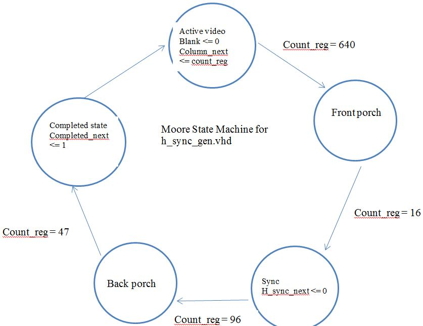

Lab1
====

## Lab1-VGA Driver

### Introduction

The purpose of this lab was to create a VGA driver to display a test pattern on a monitor. It could be done using either a Moore Machine or a Mealy Machine. For my code implementation, I chose to use a Moore Machine.


### Implementation

The following constructs were used to create the Moore State Machine for h_sync_gen.vhd. A similar construct was used for the v_sync_gen.vhd.

Basic flip-flop construct:
```VHDL
    process(reset, clk)
    begin			
		if(reset='1') then
			state_reg <= active_video;
		elsif(rising_edge(clk)) then
			state_reg <= state_next;
		end if;
	end process;
```

Next state logic code:
```VHDL
    process(state_reg, count_reg)
	begin
	state_next <= state_reg;
		case state_reg is 
			when active_video =>
				if( count_reg = 640) then
					state_next <= front_porch;
				end if;
			when front_porch =>
				if (count_reg = 16) then
					state_next <= sync;
				end if;
			when sync =>
				if (count_reg = 96) then
					state_next <= back_porch;					
				end if;
			when back_porch =>
				if (count_reg = 47) then
					state_next <= completed_state;
				end if;
			when completed_state =>
				state_next <= active_video;
			end case;	
	end process;
```

Output buffer code:
```VHDL
    process(clk)
    begin
		if (rising_edge(clk)) then
			h_sync_buf <= h_sync_next;
			blank_buf <= blank_next;
			completed_buf <= completed_next;
			column_buf <= column_next;
		end if;
	end process;
```

Look ahead output logic code:
```VHDL
    process(state_next, count_next)
    begin
		h_sync_next <= '1';
		blank_next <= '1';
		completed_next <= '0';
		column_next <= (others => '0');
		case state_next is
			when active_video =>
				blank_next <= '0';
				column_next <= count_reg;
			when front_porch =>
			when sync =>
				h_sync_next <= '0';
			when back_porch =>
			when completed_state =>
				completed_next <= '1';
		end case;
	end process;
```

Outputs for the state machine:
```VHDL
    h_sync <= h_sync_buf;
    blank <= blank_buf;
	completed <= completed_buf;
	column <= column_buf;
```

The constructs above implemented the moore machine shown in the state transition diagram below.



The same state transition diagram was used for v_sync_gen.vhd except count_reg was equal to different values for the state transitions.

The modules, each .vhd file, were connected as shown below.


### Test/Debug

* I originally began coding with previous coding methods in mind. This proved to be detrimental to my success. I then went back and began looking in the textbook for example code on how to create flip flops and the different states for a Moore Machine. Once I began following the examples in the textbook, most of the coding went really well from there on out.


* I also decided to use a test bench to test my two lowest level modules, h_sync_gen.vhd and v_sync_gen.vhd. I was able to iron out several syntax issues that were not apparent when using the "check syntax" button in ISE. 

* Once these two modules worked well according to my testbenches, I implemented the vga_sync.vhd module. This module uses the two stated above within it in order to function properly. Since I knew both of the lower level modules worked correctly, it was easy to debug signal assignment issues between the two modules by creating a testbench for vga_sync.vhd. 

* Upon completion of the testbench I determined that everything worked correctly thus far, I created and implemented the pixel_gen.vhd and atlys_lab_video.vhd modules. I did not create a test bench for these files but instead just tested them on the monitor screen. I started by just trying to make the entire monitor turn red. Once this worked I changed the colors and implemented the test pattern.

### Conclusion

An important thing I learned in this lab is that VHDL is creating hardware and traditional programming logic will lead to lots of errors. I also learned the importance of creating testbenches to test the lower level modules for errors before implementing them within larger modules. This makes debugging at the higher level modules much easier and narrows down where the problems may exist. 

### Documentation

C2C John Miller explained to me that the signals in atlys_lab_video.vhd could be identified at the bottom of the given code but needed to actually be created at the top. 
C2C Colin Busho explained some of the Moore State Machine code from the book to me and I was able to figure out which signals I needed for my code from here.


